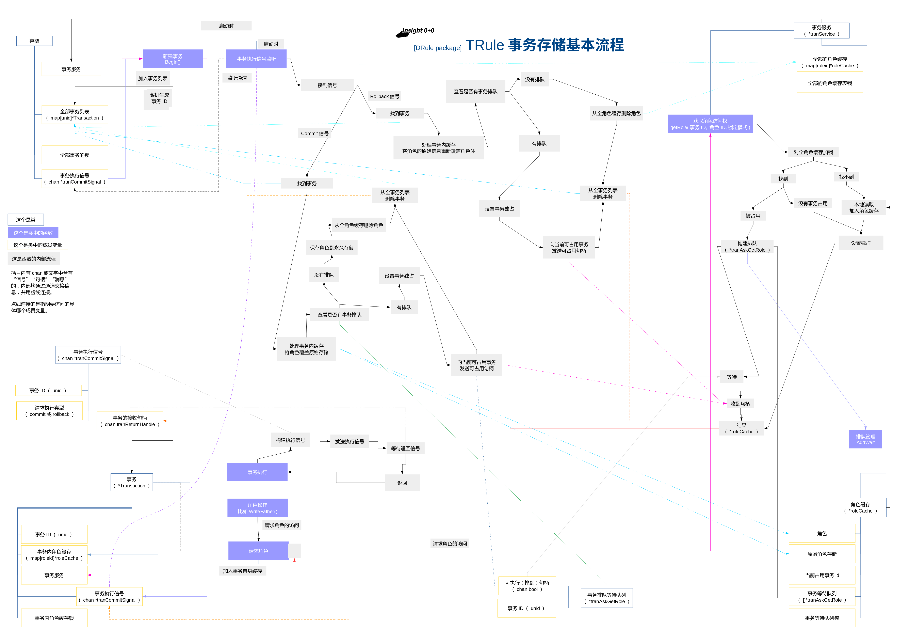

# Insight 0+0

CoderG the 2016 project, Insight 0+0 [ 洞悉 0+0 ]

*这是洞悉项目的依赖库*

*目前各包的功能完全不保证完整且无Bug，也就是说看看就行别真用。*

## 说明

Insight （洞悉 ） 是小说《[那曾经的旅程](http://hareading.com/books?bookId=1461)》（[小说繁体版链接见此](http://hareading.com/books?bookId=1461)）中起到至关重要作用的智能化系统，本项目只是把小说里的名字搬到了现实中来。

Insight 0+0并不是以实现小说中描述的强大智能为目的，它只是尝试展现一个最基本的数据抓取、规整、检索、处理的模型，也就是Insight（洞悉）可能会有的最基本原型。或者说这只是本人的个人玩乐喜好而以，并不是一个严肃的项目。

## 目前

**—— 2017年9月12日 ——**

所有和Role（角色）相关的package都将被废弃，涉及到的package包括：roles、rolesio、rcontrol、bridges、rolesplus、hardstore、drcm、drule、drule2。

Spot将代替Role。

其他被取代的package有：nst、smcs、spiders、spiders2、webs。

**—— 2017年4月27日 ——**

正在开发drule2包，也就是“分布式统治者v2”，开发完成将代替drule包。

drule2开发完成之后，大概的改进如下：

* 将各部分功能重新划分为多个子包，功能划分更为合理。

* 从下到上完全实现支持数据分区（类似关系型数据库的库）和用户认证权限系统。

* 稍作改进的事务处理，更加合理。

* 重新设计分布式的分布方式。

* 增加TLS加密连接（nst包新增功能）。

* operator不再管理镜像，只指向单一服务器。

* 增加operator_t——远程控制者控制台终端（名称暂定），可以在控制台连接和访问远程服务器并通过字符串命令进行简单配置：区域管理，用户权限管理。

**—— 2017年4月16日 ——**

在此之前，对角色编解码（保存或网络传输）需要gob中注册进相应的类型，影响了大系统下的类型复杂情况下的使用。现在这种局面将不复存在。

在roles包中，目前增加了一种专门用于存储的数据类型，名叫RoleMiddleData，它是对“角色”各种数据关系的另一种实现，保持了与操作roles.Roleer接口类型几乎一样的方法。但因为它是确定的一个类型，所以不需要再依靠gob的类型注册。也就是说，我们建立好一个drule的分布式存储器，那么扔那里就行了，之后任何新出现的“角色”类型都可以来者不拒了。

TODO：还没有完整测试，porter包还没有改

**—— 2017年4月11日 ——**

drule得到应用，drcm也许也将废弃。

重写了webs包，成为了webs2,各方面的处理更合理了。webs废弃。

重写了spiders，成为了spiders2,主要是剔除与bridges和rolesplus相关的东西。spiders废弃。

**—— 2017年3月27日 ——**

增加了drule包，作为一套新的分布式角色控制系统，并以此代替之前的drcm包。drule包实现了基础的事务功能，且在其他方面对代码进行了有优化。目前本包已经通过了最基本的测试。

事务的实现流程图如下：

**—— 2017年3月3日 ——**

增加了“搬运工”（porter）这个package，提供在网络上搬运复制角色的功能。

**—— 2017年2月27日 ——**

Distributed Roles Control Machine（分布式角色控制机）通过了基本测试。

**—— 2017年2月18日 ——**

最近进行了drcm包的首次测试，虽然这个包已经写了很久，但这次测试却只停留在单一的角色存储上。

drcm是Distributed Roles Control Machine的缩写，也就是“分布式角色控制机”。按照目前的规划，它算是整个Insight的一个核心底层功能，很重要，与“角色”一样。

*先插播一句：无论drcm下的Operator和ZrStorage，又或是更底层的HardStore，都是对“角色”进行操作，所以它们并不是通用型的NoSQL/SQL数据库，并不是以保存通用数据为目的。虽然它们有改造成通用型的基础和条件，但我可能不会这么做。*

“角色”不仅是记录数据，更重要的是记录“角色”间有可能极端复杂的相互交叉交错的关系，而这种复杂关系也使得每个“角色”都可以成为一个数据节点参与大规模数据运算。也可以说“角色”是一个运算器可能放在外面神经元节点，而整个系统则是一个兼顾存储的大数据分析器或机器学习机，这只取决于使用的运算方法。

当“角色”的想法扩大到大数据这个层面上来，一个可以将“角色”分布存储和分布运算的平台就显得至关重要，drcm就是为了解决这个问题的。

drcm的ZrStorage（锆存储）直接、简单、明了的提供与普通数据库管理器类似的主从（master-slave）模式，并同时提供直接的本地使用模式。它自身实现了rolesio.RolesInOutManager接口定义的所有方法，使得它可以只获取和修改某个“角色”的单一属性和数据，减少网络的流量占用。slave提供简单的身份验证方法。master利用配置的路由策略（依据角色名的第一个字母）使用slave且支持镜像slave。可设置内存缓存，减少硬件IO操作。本地的硬盘永久保存使用hardstore包。

为了应对drcm的所需，nst进行了大规模升级改造。

nst，也就是Network Socket Transmission——网络套接字封装，它把go语言net包中的tcp常用功能进行了再次封装，包括服务器和客户端的创建，以及各种数据的发送、接受、转码等。

配合drcm对nst的改造，使nst的server-client沟通更加复杂完善。可以不再依赖“通讯桥”，默认使用长连接，含有心跳检测和断线重连，连接池的轮轮询配以及连接独占锁。

本次测试，使用了一台控制器（Operator）、一台主数据服务器（Master）、一台从数据服务器（Slave），控制器生成两个角色，并通过网络提交给Master保存。Master根据主从配置要求，将其中一个角色交给Slave保存。

## Packages List

### pubfunc

一套各个包中都会用到的基础函数。

### cpool

配置池。读取配置文件，并按要求提供具体的配置项。支持运行时配置文件重载。但目前并不支持配置项的运行时修改与保存。

### random

随机数与随机字符串生成。最重要目的是为角色生成40位字符串的非重复ID。

### roles (discard)

基本角色接口与基本角色类型。基本角色主要负责保存角色与它的父子、朋友关系。

### rolesio (discard)

角色存储接口与空存储类型。提供将角色关系以及角色信息保存进永久存储（如硬盘）的方式。

### hardstore (discard)

硬存储库，实现rolesio的部分功能，将角色和角色关系保存进永久存储。

### rcontrol (discard)

角色控制器。负责生成角色、设置角色关系、调用存储。 **（可能在将来废弃）**

### bridges (discard)

数据交换桥。提供一个角色间数据传递的桥梁。交换桥为子进程运行，触发执行。 **（可能在将来废弃）**

### rolesplus (discard)

增强角色类型。提供了实体嵌入其他角色（指针）的基本功能。并提供了使用数据交换桥的方法。 **（可能在将来废弃）**

### nst (discard)

网络通信封装。提供TCP的server和client。支持TLS加密。

### smcs (discard)

状态监控与配置蔓延。节点与中心间的沟通方式。 **（废弃，目前代码保留）**

### smcs2

状态监控与配置蔓延。节点与中心间的沟通方式。

### idb

一个连接PostgreSQL的方法，未来会支持更多数据库的连接。

### ilogs

简单的管理运行日志和错误日志。

### webs (discard)

一个无限级分类路由的HTTP服务器实现，从CoderG->Metropolis项目简化移植而来。 **（废弃，目前代码保留）**

### webs2

一个无限级分类路由的HTTP服务器实现，从CoderG->Metropolis项目简化移植而来。

### spiders (discard)

蜘蛛抓取器。注意：这部分还未完成。 **（废弃，目前代码保留）**

### spiders2 (discard)

蜘蛛抓取器。注意：部分功能没有完成。 

### porter

一个服务期间搬运“角色”的组件。

### drcm (discard)

分布式“角色”存储管理。 **（刚一出生就被drule所取代）**

### drule (discard)

支持事务的分布式“角色”存储管理。
