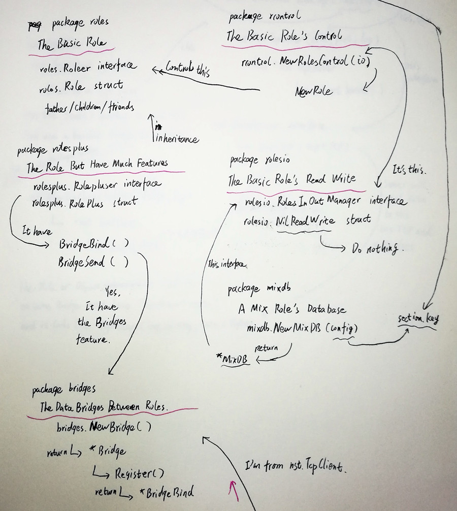

# 角色间的数据交换——通讯桥

主要包：bridges

配合包：rolesplus

------

bridges包提供了一套多进程间数据交换、广播的方法。并且与rolesplus包配合在一起，实现了角色间的数据分发与触发方法执行的机制。

在表面看来，通讯桥可以比喻成一个房间，而注册进通讯桥中的角色（满足RolePluser接口）则可以比喻成走进房间里的人。某个人说出一句话，房间里的其他人都会对这句话作出属于自己的反应。房间里的所有人都是平等的，他们都有权说话，也都会对别人所说的话做反应。

就如同“角色”概念中所展现出的灵活关系一样，通讯桥容纳的角色数量并没有任何的限制，而rolesplus包也保证了每个角色都可以同时处于许多房间之中。

通讯桥在使用层面上看起来相当简单，不过是建立（绑定）桥、将角色注册进桥、让角色启动对桥的接收，之后就只是在需要的时候向桥中发送数据，并一直听着别人是否给自己发送了数据并作出相应动作（调用某个方法）。但看起来的简单，实际上是高度封装的结果，是并发、通道、空接口、反射综合利用下的产物。

bridges包提供了新建通讯桥（NewBridge）以及注册进通讯桥（Register）的方法。其中Register方法将返回BridgeBind数据结构，包含共用的发送通道（Send）以及独有的接收通道（Receive），供注册进通讯桥的角色使用。通讯桥从创建起就开启了新进程接收Send通道传进来的数据。

rolesplus包则包含了实现管理绑定多个通许桥（BridgeBind）、向某个桥发送信息（BridgeSend）。当执行了角色的启动通讯桥（StartBridge）的方法后，一组新的进程将负责所有通讯桥的Receive通道的监听。

bridges包中定义了通讯桥中交换数据的结构（BridgeData），此结构中的Operate将提供给rolesplus包中的通讯桥监听管理，依靠反射调用角色中相应的方法，将类型为空接口（interface{}）的Data数据发送给那个方法。

可以看出来，通讯桥大量使用了Go语言提供的并发机制，并在使用中建立了大量的进程，故肯定会有效率与资源占用方面的担忧。但Go语言中的goroutine属于开销很小的协程，所以效率与占用方面并不需要担心。

下图是bridges包和rolesplus包与其他包的简单关系，并不完整全面，只作为简单的概念展示。

大概的使用与调用代码如下：

	// 新建桥	
	b1 := bridges.NewBridge(nil);
	// 注册桥
	a1 := b1.Register("注册名1");
	// 注册桥
	a2 := b1.Register("注册名2");
	// 向a1也就是b1桥发送数据，数据类型为bridges.BridgeData
	a1.Send <- bridges.BridgeData{Id: "注册名1", Operate: "SomeMethod" Data : "发送的某些数据"};
	
	// 使用RolesControl创建一个类型为RolePlus的角色rp1
	rp1 := rc.NewRole("RolesUnid", &rolesplus.RolePlus{});
	// 类型断言操作，用RolesControl工具才需要进行的步骤
	rp1b := rp1.(*rolesplus.RolePlus);
	// 将刚生成的角色与b1桥绑定在一起，绑定多个桥就逐个绑定
	rp1b.BridgeBind("注册名3",b1);
	// 启动RolePlus类型角色rp1b内置的桥处理，现在rp1b可以接收b1桥的数据或发送数据了
	rolesplus.StartBridge(rp1b);
	
上面的代码涉及到了其他Inight 0+0中重要的基础功能与包，在其他的文档中有详细的讲解，故不在此罗嗦。
